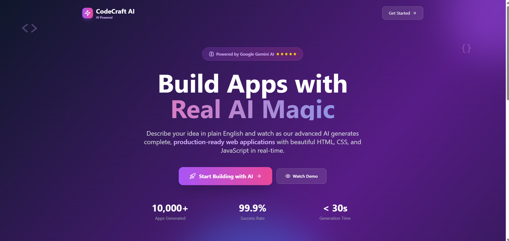
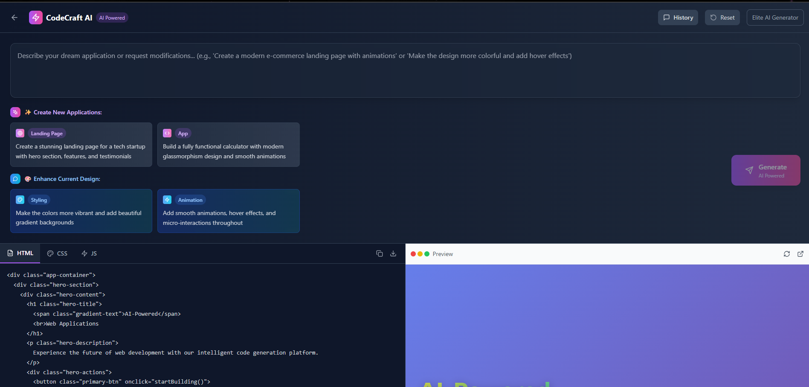
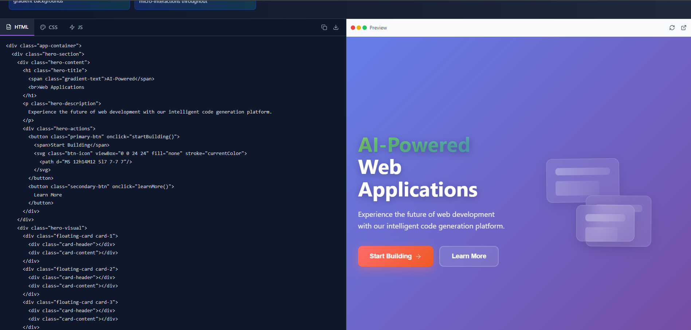

# CodeCraft AI

**CodeCraft AI** is a next-generation web application generator powered by Google Gemini AI. Designed for developers, designers, and founders, it transforms plain English prompts into fully functional, beautiful web apps in real-time.

💡 Just describe your idea — and watch the AI craft HTML, CSS, and JavaScript code instantly.
---

## Features





- **AI-Powered Code Generation:** Uses Google Gemini AI to generate unique, high-quality web apps from user prompts.
- **Modern UI/UX:** Beautiful landing page and editor interface built with React, Tailwind CSS, and Lucide React icons.
- **Live Preview:** Instantly see the generated app in a sandboxed iframe.
- **Editable Code:** View and copy HTML, CSS, and JS code in a tabbed editor.
- **Iterative Conversation:** Enhance or modify your app with conversational requests; full conversation history is available.
- **Production-Ready Output:** Generated code follows best practices for design, accessibility, and responsiveness.
- **Reset & History:** Start fresh or review your prompt/response history at any time.


---

## Project Structure

```
.
├── .env                  # API keys and environment variables (not committed)
├── index.html            # Main HTML entry point
├── package.json          # Project metadata and scripts
├── postcss.config.js     # PostCSS config for Tailwind
├── tailwind.config.js    # Tailwind CSS config
├── tsconfig*.json        # TypeScript configs
├── vite.config.ts        # Vite build config
├── .bolt/                # Project template/config for Bolt
│   ├── config.json
│   └── prompt
└── src/
    ├── App.tsx           # Main React app component
    ├── main.tsx          # React entry point
    ├── index.css         # Tailwind CSS imports
    ├── components/       # UI components
    │   ├── CodeEditor.tsx
    │   ├── ConversationHistory.tsx
    │   ├── EditorInterface.tsx
    │   ├── LandingPage.tsx
    │   ├── PreviewPane.tsx
    │   └── PromptInput.tsx
    ├── services/
    │   └── aiService.ts  # Handles AI code generation and conversation
    └── utils/
        └── codeGenerator.ts # (Deprecated) Fallback code generator
```

---

## Getting Started

### 1. Prerequisites

- **Node.js** (v18+ recommended)
- **npm** (v9+ recommended)
- **Google Gemini API Key** (for AI code generation)

### 2. Installation

Clone the repository and install dependencies:

```sh
npm install
```

### 3. Configure Environment

Create a `.env` file in the project root:

```
VITE_GEMINI_API_KEY=your-google-gemini-api-key-here
```

> **Note:** The `.env` file is excluded from version control.

### 4. Run the Development Server

```sh
npm run dev
```

Open [http://localhost:5173](http://localhost:5173) in your browser.

---

## Usage

1. **Landing Page:** Click "Get Started" to enter the editor.
2. **Describe Your App:** Enter a prompt (e.g., "Create a modern portfolio site with animations").
3. **AI Generation:** Wait for the AI to generate code. View the output in the code editor and live preview.
4. **Iterate:** Submit further prompts to enhance or modify your app. Review the conversation history.
5. **Copy/Download Code:** Use the editor's buttons to copy or download HTML, CSS, or JS.

---

## Tech Stack

- **React 18** (with hooks)
- **Vite** (fast dev/build)
- **TypeScript**
- **Tailwind CSS** (utility-first styling)
- **Lucide React** (icon library)
- **Google Gemini AI** (`@google/generative-ai`)

---

## Customization

- **Styling:** Tailwind config in [`tailwind.config.js`](tailwind.config.js)
- **AI Prompting:** System prompt and code parsing in [`src/services/aiService.ts`](src/services/aiService.ts)
- **UI Components:** All UI in [`src/components/`](src/components/)

---

## Scripts

| Command         | Description                  |
|-----------------|-----------------------------|
| `npm run dev`   | Start development server    |


---

## Environment Variables

- `VITE_GEMINI_API_KEY` – Your Google Gemini API key (required for AI code generation)

---

## Contributing

1. Fork the repo and create your branch.
2. Make changes and test locally.
3. Submit a pull request.

---


---

## Credits

- [Google Gemini AI](https://ai.google.dev/)
- [Lucide Icons](https://lucide.dev/)
- [Tailwind CSS](https://tailwindcss.com/)
- [Vite](https://vitejs.dev/)

---

## Key Files

- [`src/App.tsx`](src/App.tsx)
- [`src/components/LandingPage.tsx`](src/components/LandingPage.tsx)
- [`src/components/EditorInterface.tsx`](src/components/EditorInterface.tsx)
- [`src/services/aiService.ts`](src/services/aiService.ts)
- [`src/components/CodeEditor.tsx`](src/components/CodeEditor.tsx)
- [`src/components/PreviewPane.tsx`](src/components/PreviewPane.tsx)
- [`src/components/PromptInput.tsx`](src/components/PromptInput.tsx)
- [`src/components/ConversationHistory.tsx`](src/components/ConversationHistory.tsx)

---

**Start building your next web app with real AI
